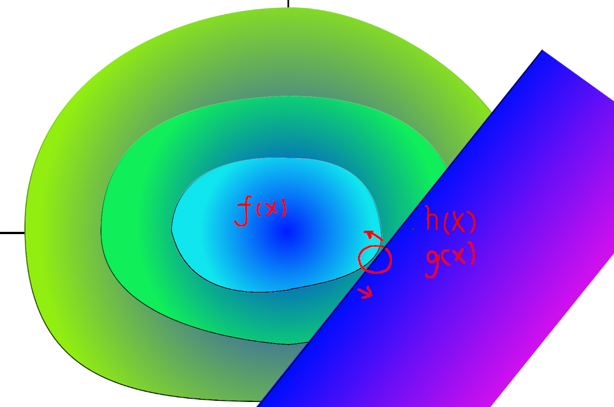

## Linear programming
- problem
$$

\begin{gathered}
minf(X)=CX \\
AX+B \geq 0
\end{gathered}
$$

- principle
Minumum must at cross point of constraints. Solve space of constraints is a convex polygon zone in high dimension, so start from a valid point and search along constraint and normal vector of C, we will find minimum finally.
The key is how to implement search method with a high efficiency algorithm.----simplex method.

- algorithm
Todo

## Lagrangian multiplication method
- problem
$$
\begin{gathered}
min \ f(X) \  , (\text{convex function}) 
\\
h_{i}(X) = 0
\\
g_{i}(X) \ge 0
\end{gathered}
$$
- visualize

According to graph, the solve must be at edge of $f(X)$ and $g_{i}(X)$ or $h_i{X}$ where normal vetor of $f(X)$ and $g_{i}(X)$ or $h_i(X)$ in opposite direction. Considering $h_i(X) = 0 \ equal\ to\ h_i(X)$
- principle
According to above, we can easily get constraints of solve, but how can we define which $i$ of $g_{i}(X)$ is the actice edge? We can find that if it is not active, w don't need to constraint it, we can give it a weight 0.
Now, the optimizw solve must meet following constraints.
We can solve them to get potential solution.
$$\begin{cases}
f'(X)-a_i \cdot h'(X)-b_i \cdot g'(X)=0
\\
b_i \cdot g(X)=0
\\
b_i \ge 0
\\
g_{i}(X) \ge 0
\\
h_{i}(X) = 0
\end{cases}$$

- strong dual problem
According to above, we can transform origin problem to following.
$$\begin{gathered}
min \  f(X)-ag(X)
\end{gathered}$$

